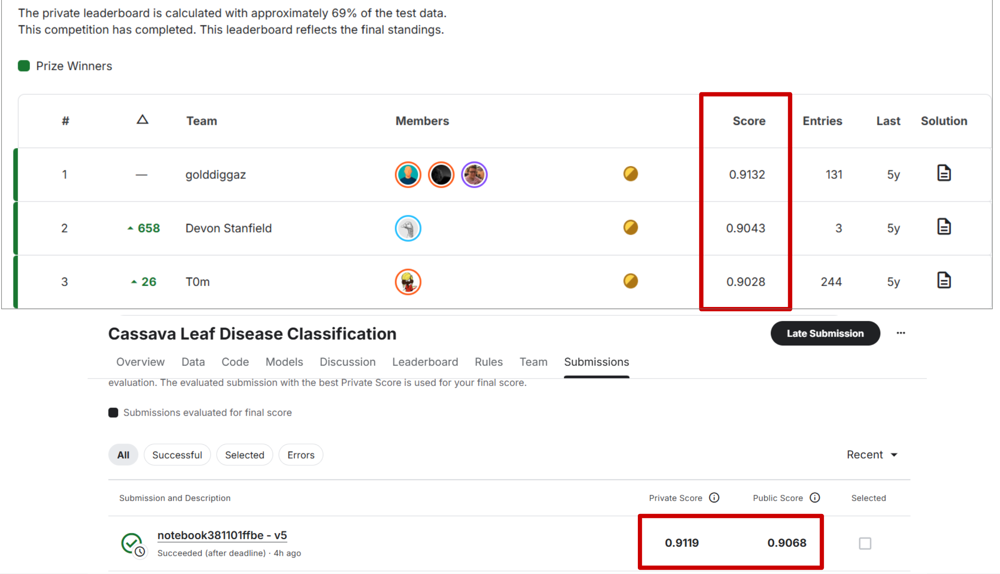
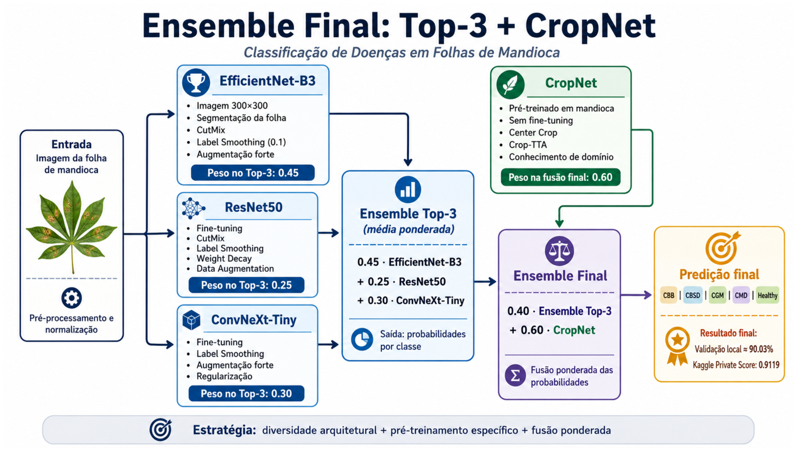

# 🌿 Cassava Leaf Disease Classification

Projeto de **Deep Learning e Visão Computacional** desenvolvido para classificação automática de doenças em folhas de mandioca, utilizando o dataset da competição **Cassava Leaf Disease Classification — Kaggle**.

O trabalho explorou diferentes arquiteturas, estratégias de regularização, pré-processamento, ensembles e técnicas de interpretabilidade, evoluindo de um baseline de aproximadamente **85% de acurácia** para um ensemble com **90,03% de validação local**.

### 🏆 Resultado no Kaggle

| Métrica              |                           Resultado |
| -------------------- | ----------------------------------: |
| Validação local      |                          **90,03%** |
| Kaggle Public Score  |                          **0,9068** |
| Kaggle Private Score |                          **0,9119** |
| Ranking equivalente  | **2º lugar no leaderboard privado** |

> A submissão foi realizada após o encerramento oficial da competição. O score privado obtido seria equivalente à **2ª colocação no leaderboard final**.

<p align="center">
  
</p>

---

## 📄 Relatório completo

A metodologia, experimentos, resultados e análises de interpretabilidade estão documentados no relatório completo:

**[📑 Abrir relatório — Cassava Leaf Disease Classification](./cassava/T4%20Cassava%20%281%29.pdf)**

---

# 🎯 Problema

O objetivo é classificar fotografias de folhas de mandioca em **cinco classes**:

* quatro categorias de doenças;
* uma categoria de folha saudável.

O dataset possui mais de **21 mil imagens rotuladas por especialistas**, mas apresenta desafios comuns a problemas reais de Visão Computacional:

* forte **desbalanceamento de classes**;
* possível **ruído nos labels**;
* variações de iluminação;
* diferentes ângulos e escalas;
* fundos complexos;
* sintomas visualmente semelhantes entre classes.

Por isso, o projeto foi tratado não apenas como treinamento de uma CNN, mas como um processo experimental envolvendo **pré-processamento, regularização, escolha arquitetural, análise de erros e ensemble**.

---

# 🧠 Abordagem

O desenvolvimento seguiu um ciclo experimental incremental:

```text
Dataset
   ↓
Análise e pré-processamento
   ↓
Baseline com Transfer Learning
   ↓
Regularização e Data Augmentation
   ↓
Comparação de arquiteturas
   ↓
Modelos especializados
   ↓
Ensemble
   ↓
Interpretabilidade
   ↓
Submissão Kaggle
```

---

# 🏗️ Arquiteturas e Ensemble

Foram avaliadas arquiteturas com características complementares:

### ResNet50

Utilizada inicialmente como baseline com pesos pré-treinados na ImageNet.

O fine-tuning do backbone mostrou-se significativamente superior ao uso da rede apenas como extratora de features para classificadores como SVM e XGBoost.

---

### EfficientNet-B3

Utilizada com imagens de maior resolução e **segmentação baseada em cor**, buscando reduzir a interferência do fundo e preservar características locais das folhas.

Principais técnicas:

* CutMix;
* Label Smoothing;
* Data Augmentation;
* segmentação;
* resolução de `300 × 300`.

**Validação: 88,29%**

---

### ConvNeXt-Tiny

Arquitetura convolucional moderna utilizada para produzir representações complementares às obtidas pelas outras CNNs.

**Validação: ~87,7%**

---

### Vision Transformer

Também foi explorado um **ViT Base Patch16**, realizando fine-tuning ponta a ponta.

A atenção global apresentou bom desempenho principalmente nas classes minoritárias.

**Validação: 88,60%**

---

### CropNet

Modelo pré-treinado especificamente para doenças em mandioca.

Diferentemente das outras arquiteturas, o CropNet já possuía conhecimento visual específico do domínio.

Com **crop-TTA**, alcançou:

**Validação: 89,31%**

---

## Ensemble Final

A solução final combina modelos com erros e representações diferentes:

```text
          EfficientNet-B3
                │
              0.45
                │
ResNet50 ───────┼─────── ConvNeXt-Tiny
   0.25         │             0.30
                ▼
        Ensemble PyTorch
                │
                │ 0.40
                ▼
           Fusão final
                ▲
                │ 0.60
             CropNet
```

<p align="center">
  
</p>

A estratégia explora **diversidade arquitetural + conhecimento específico de domínio**, reduzindo a dependência dos erros individuais de cada modelo.

---

# ⚙️ Técnicas experimentadas

Ao longo dos experimentos foram avaliadas diferentes técnicas para aumentar a capacidade de generalização.

### Data Augmentation

Transformações geométricas e fotométricas simulam parte da variabilidade encontrada nas imagens reais:

* flips;
* rotações;
* crops;
* alterações de brilho e contraste;
* redimensionamento;
* perturbações locais.

### Label Smoothing

Utilizado principalmente devido à presença de possíveis **labels ruidosos**, reduzindo a confiança excessiva do modelo.

### CutMix

Combina regiões e labels de diferentes imagens, reduzindo a dependência de regiões excessivamente específicas.

### Segmentação

Foi utilizada segmentação baseada em cor para diminuir a influência de elementos externos à folha, como solo e outras plantas.

### Test-Time Augmentation

Foram realizadas múltiplas inferências sobre versões transformadas da mesma imagem.

Um resultado importante foi observar que **TTA não melhorou todos os modelos**, reforçando a necessidade de validar empiricamente cada técnica em vez de assumir benefícios universais.

---

# 📊 Evolução dos experimentos

| Abordagem                        |  Validação |
| -------------------------------- | ---------: |
| ResNet50 baseline                |     ~85,0% |
| ResNet50 + Label Smoothing + TTA | **88,03%** |
| EfficientNet-B3 + segmentação    | **88,29%** |
| ViT                              | **88,60%** |
| Ensemble PyTorch                 | **88,90%** |
| CropNet + crop-TTA               | **89,31%** |
| **Ensemble final + CropNet**     | **90,03%** |

O ganho final foi de aproximadamente **5 pontos percentuais em relação ao baseline inicial**.

---

# 🔍 Interpretabilidade e análise de erros

Além da acurácia, o projeto investigou **por que os modelos tomavam determinadas decisões**.

Foram utilizadas:

* galerias de erros;
* análise de confiança e entropia;
* **Grad-CAM**;
* Grad-CAM direcionado à classe verdadeira;
* **Occlusion Sensitivity**.

O objetivo era investigar perguntas como:

> O modelo está realmente observando os sintomas da folha?

> Ou está tomando decisões com base no fundo e em correlações espúrias?

> Um erro é consequência do modelo ou de um possível label incorreto?

As amostras foram separadas em grupos como:

```text
Acertos de alta confiança
Erros de alta confiança
Alta incerteza / entropia
Baixa probabilidade da classe verdadeira
Amostras representativas por classe
```

As análises com Grad-CAM e oclusão permitiram identificar regiões da imagem que mais influenciaram as predições e investigar possíveis padrões de erro.

---

# 🧪 Pipeline

A implementação utiliza **PyTorch** e uma estrutura modular para carregamento de dados e experimentação com modelos.

```text
Imagem
  ↓
OpenCV
  ↓
Transformações / Augmentation
  ↓
PyTorch Dataset + DataLoader
  ↓
Backbone pré-treinado
  ↓
Fine-tuning
  ↓
Probabilidades por classe
  ↓
TTA / Ensemble
  ↓
Predição
```

A classe `CassavaDataset` centraliza o carregamento das imagens e aplicação das transformações, enquanto os modelos são separados em módulos próprios.

Estrutura principal:

```text
Trabalho-4---MC906/
│
├── data/
│
├── models/
│   ├── baseline.py
│   ├── cnn_transformer.py
│   ├── model_factory.py
│   ├── resnet_dense.py
│   └── resnet_heads.py
│
├── cassava/
│   ├── arquitetura.png
│   ├── resultados.png
│   └── T4 Cassava (1).pdf
│
├── dataset.py
├── train.py
├── requirements.txt
└── README.md
```

---

# 🛠️ Stack

**Linguagem**

* Python

**Deep Learning**

* PyTorch
* Torchvision
* Transfer Learning
* Fine-tuning

**Computer Vision**

* OpenCV
* Albumentations
* Grad-CAM
* Occlusion Sensitivity

**Modelos**

* ResNet50
* EfficientNet-B3
* ConvNeXt-Tiny
* Vision Transformer
* CropNet

**Técnicas**

* Data Augmentation
* CutMix
* Label Smoothing
* Segmentation
* Test-Time Augmentation
* Model Ensembling

---

# 💡 Principais aprendizados

O projeto evidenciou alguns aspectos importantes de Machine Learning aplicado:

**Fine-tuning importa.**
Features genéricas da ImageNet não foram suficientes para obter o mesmo desempenho que modelos adaptados ao domínio.

**Conhecimento de domínio pode superar escala.**
O CropNet, pré-treinado especificamente para doenças de mandioca, superou individualmente diversas arquiteturas ajustadas no projeto.

**Mais técnicas não significam necessariamente melhor resultado.**
TTA melhorou alguns modelos e prejudicou outros.

**Diversidade é fundamental em ensembles.**
Combinar arquiteturas com comportamentos diferentes foi mais eficiente do que depender apenas do modelo individual de melhor desempenho.

**Interpretabilidade ajuda a entender falhas reais.**
Grad-CAM, análise de incerteza e oclusão permitiram investigar se as decisões estavam relacionadas a sintomas relevantes ou a características espúrias da imagem.

---

# 👥 Equipe

Projeto desenvolvido para a disciplina **MC906 — Introdução à Inteligência Artificial**, UNICAMP.

* Isabel Salles
* Victor Luigi
* Rafael Feltrin
* Bruno Salles
